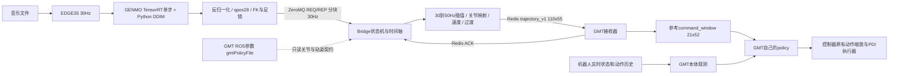

# BUMI music-only：环境、导出、TensorRT、运行与数据流手册

适用分支：完整仓库 `feature/bumi-music-only`；运行分支 `deploy/bumi-music-only-gmt`。
本机完整仓库 `/home/weili/GENMO`，部署目录 `/home/weili/GENMO-deploy-bumi`。
模型为 BUMI v5 scratch s350000。本手册的命令按当前实测环境编写，目标机路径可以调整。

**控制器自己选择 policy。** GENMO 的 ONNX/engine 描述音乐生成模型，不描述 GMT 控制策略。
Bridge 正常启动不传 `--gmt-policy`，只读 GMT 已启动后的 ROS 参数 `/gmtPolicyFile`，
获取它实际配置的关节顺序和默认姿态，不设置 ROS 参数、不改 launch、不选择 GMT 权重。
修改 GMT 策略配置后，重新启动 GMT 和 Bridge，使两者重新建立契约；不支持热切换策略。

相关文档：

- [GMT 接收端逐文件移植说明](BUMI_GMT_GENMO_INTERFACE.md)
- [同款 GMT 首次接入：可复制文件与具体代码修改](../integrations/gmt/README.md)
- [适配其他 GMT、SONIC 或通用控制器的开发指南](GENMO_CONTROLLER_ADAPTATION.md)
- [运行依赖锁](../requirements/deployment/runtime.lock)
- [代码与验证历史](../记录文本.md)

## 1. 先判断需要做哪些准备

| 情况 | 需要做的事 |
|---|---|
| 在当前电脑运行已交付 s350000 | 已有部署 `.venv`、ONNX、engine；做安装检查，然后按三个终端启动 |
| 复制到同型号 GPU、同 TensorRT 环境的新电脑 | 复制代码和完整模型目录，重新创建 Python 环境；不要复制 `.venv` 或 worktree 的 `.git` 文件 |
| 换 GPU 型号或 TensorRT/libnvinfer 环境 | 准备目标构建环境，在完整仓库构建并验证新 engine，再交付部署目录 |
| 更新 GENMO checkpoint | 在完整仓库重新导出 ONNX、构建 engine、数值对照和打包 |
| 只更新 GMT 自己的权重，输入/机器人契约未变 | 在 GMT 自己的代码/配置中更新；重启 GMT 和 Bridge，无需重新导出 GENMO |
| 换控制器或改变关节数、窗口、坐标语义 | 按适配指南修改 Bridge/接收端，不能只更换 policy 文件名 |

当前机运行环境已经可用。下文安装命令主要用于新电脑，不需要在当前环境重复安装。
部署端仍需要 PyTorch 做 DDIM、张量与运动学计算；去掉训练框架不等于去掉 PyTorch。

## 2. 三套环境的职责

| 环境 | 用途 | 依赖与位置 |
|---|---|---|
| 完整 GENMO 环境 | checkpoint→ONNX、TensorRT构建、PyTorch对照 | `/home/weili/GENMO/.venv`；保留Hydra、Lightning、模型类、配置等导出依赖 |
| 最小 GENMO 运行环境 | EDGE35、常驻推理、DDIM、后处理、Bridge | `/home/weili/GENMO-deploy-bumi/.venv`；不需要Hydra、Lightning、T5、SMPL、GMR、训练数据 |
| 控制器环境 | GMT策略、机器人状态、仿真/实机控制 | `noetic`内的GMT工作区；它自行加载policy、构造本体观测并执行控制 |

本机核验基线：Ubuntu22.04 x86_64，Python3.10.12，RTX4090，驱动580.159.03，
Torch2.6.0+cu124，TensorRT Python10.13.3.9，系统libnvinfer10.13.3.9。
`torch.version.cuda`的12.4与TensorRT系统包的`+cuda13.0`分别属于不同组件，不要求字符串相同；
必须检查实际动态库、驱动和engine元数据，不能只看`nvidia-smi`显示的CUDA上限。

## 3. 新电脑：解压后一次安装

### 3.1 只需执行一个安装入口

当前发布包面向 **Ubuntu 22.04 x86_64 / RTX 4090**。目标电脑先有能正常识别 GPU 的
NVIDIA 驱动，并可访问 Python/NVIDIA 下载源。GENMO 部署环境由安装器准备：

```bash
tar -xzf /path/to/bumi_music_only_gmt_s350000.tar.gz
cd GENMO-deploy-bumi
bash install.sh
```

也可以用文件管理器解压，再进入该目录执行最后一行。不要在完整训练仓库执行安装器；
脚本会识别并拒绝，以免改变训练环境。当前已安装的部署目录可以重复运行，会复用匹配依赖。

安装器依次执行：

1. 检查 NVIDIA 驱动和平台。
2. 复用 uv；没有时将固定版本 uv 安装到项目 `.tools/`，不改 shell 配置。
3. 创建 Python 3.10 `.venv`；缺 Python 时由 uv 自动下载，不需要先装 pip/venv 系统包。
4. 安装 `runtime.lock` 的固定版本；已有匹配 TensorRT 直接复用，否则自动安装同版 binding
   和虚拟环境内的 TensorRT 库。无需手动配置 NVIDIA APT 源或安装系统 libnvinfer。
5. 缺 FFmpeg/ffplay、Redis 工具时通过 APT 安装；只有这一步可能要求输入 sudo 密码。
6. 校验完整模型包及 GPU/engine 环境，并真实执行一次固定形状去噪。最后显示检查通过。

不自动安装/替换 NVIDIA 驱动或 GMT 的 ROS/Docker 环境。驱动需支持当前 CUDA 13 运行库，
本机已验证版本是 580.159.03；新机是否兼容以最后的实际 engine 推理检查为准。
第一次需要下载 PyTorch、CUDA、TensorRT 等大依赖；一键指操作入口少，不表示不用下载。

### 3.2 之前为什么有很多安装命令

之前把底层的手工安装路线直接作为主流程展示。现由 `install.sh` 统一处理，用户不需要
逐项执行，也不需要混用 pip 与 uv。

| 项目 | 新机器是否需要用户先手动安装 | 作用 |
|---|---|---|
| `python3.10-venv`、`python3-pip` | 不需要，uv 处理 Python 和虚拟环境 | 之前的手工 venv/pip 路线所需 |
| Git | 解压部署包不需要 | 只在用 Git 拉代码/同步代码时需要 |
| uv | 不需要，安装器自动准备 | 下载 Python 和安装锁定依赖 |
| FFmpeg/ffplay | 缺少时安装器自动装 | 音频处理/播放，不是 Python 的安装工具 |
| Redis server/client | 缺少时安装器自动装 | Bridge 与 GMT 的轨迹/ACK 通信 |
| TensorRT | 自动复用或安装到 `.venv` | 加载 GENMO engine 执行加速推理 |
| pytest、训练框架、T5、SMPL | 运行包不需要 | 开发测试或训练/人体分支用途 |

uv 不要求先安装 Python，见 [uv 官方 Python 管理说明](https://docs.astral.sh/uv/guides/install-python/)。
TensorRT 可使用虚拟环境内的 Python 包及运行库，见
[NVIDIA Python 安装说明](https://docs.nvidia.com/deeplearning/tensorrt/10.x.x/installing-tensorrt/install-pip.html)。

`--no-deps` 仍可能出现在**安装器内部**：已存在同版系统库时只装 binding；缺库时安装器会
显式安装锁定的全部所需库。旧 TensorRT 10.13.3.9 的 wheel 元数据引用已经废弃的
`nvidia-cuda-runtime-cu13` 包，故另锁 `nvidia-cuda-runtime==13.0.96`，并处理其新库目录。
这是安装器的兼容处理，用户不用再判断应装哪一套。不会安装完整训练包或执行 `pip install -e .`。

### 3.3 TensorRT、ONNX、engine 分别是什么

```text
训练 checkpoint → 导出 ONNX → TensorRT 构建 engine → 部署程序加载 engine
                    通用计算图     针对目标 GPU 优化      每个 DDIM 步调用一次
```

TensorRT 是 NVIDIA 的神经网络推理优化和执行软件。ONNX 保存模型计算图及权重；
`.engine` 保存 TensorRT 针对硬件/版本编译好的执行计划。它们描述的都是 **GENMO 生成模型**。
GMT 仍由自己的代码加载控制策略，GENMO TensorRT 不替换 GMT。

本部署中 TensorRT 加速去噪网络，Python/PyTorch 保留 EDGE35、DDIM 调度、滑窗和后处理。
因此运行环境仍有 PyTorch，但没有训练框架。播放另一首音乐不需要重新导出或构建 engine。

都是 RTX 4090 时可以复用已构建 engine，前提是平台、TensorRT 版本与模型契约匹配，
每台电脑执行 `bash run.sh check`。仅同为 4090 不能保证任意 TensorRT/Linux/Windows 环境
通用。当前未开启任意版本或跨平台兼容模式，见
[NVIDIA engine 可移植性说明](https://docs.nvidia.com/deeplearning/tensorrt/10.x.x/getting-started/support-matrix.html)。

### 3.4 可以直接压缩部署代码，以后只换模型

可以。压缩 `GENMO-deploy-bumi` 中的代码、`deployment.ini`、依赖锁和完整 `models/`。
不要包含 `.git`、`.venv`、`.tools`、测试缓存；虚拟环境中的解释器路径不能当作便携安装包。
交付的 `bumi_music_only_gmt_s350000.tar.gz` 就是这种包，包含代码及 s350000 六项模型资产。
Git 分支本身不包含被忽略的大模型文件，只压缩 Git 跟踪文件会漏掉模型。

以后升级同一 BUMI qpos30/contact 契约的模型：

1. 在完整仓库执行第 5–7 节的导出、构建、数值验证、资产打包。
2. 将新**完整模型目录**复制到部署目录的 `models/新模型名/`。
3. 用编辑器改 `deployment.ini` 的 `[model] manifest`，指向新目录的 `deployment.json`。
4. 执行 `bash run.sh check`，然后重启 Bridge 和 GENMO。

无需重装 Python 环境。不能只替换一个 `.ckpt`/`.engine` 而保留旧元数据、stats 或
kinematics；完整 SHA256 校验会拒绝混用。变更模型形状/表示/机器人契约时还需适配代码。

### 3.5 GMT 环境独立准备

已有 GMT 的电脑沿用自己的环境；单独复制 GENMO 部署包不会同时安装 ROS、Docker、
机器人模型或 GMT。当前 `noetic` 使用 host 网络，工作区是一个 bind mount：

```text
宿主机：/home/weili/docker_projects/bumi_GMT_deployment_listao/bumi_GMT_deployment_obs
容器内：/host/Documents/bumi_GMT_deployment_obs
```

同一份磁盘文件在容器内外具有不同路径。例如 ROS 参数给出容器内的
`/host/Documents/bumi_GMT_deployment_obs/src/.../policy/bumi/某模型.onnx`，Bridge 在宿主机
读取不到该路径，就通过 `docker inspect noetic` 找到挂载对应关系，读取宿主机的同一文件。
**bind mount 是文件路径映射，不是端口转发。** 不下载、不复制或替换 GMT 的模型。

用编辑器在 `deployment.ini` 修改 `[gmt] container`；默认 `noetic`。GMT 不在容器运行，
且 ROS 参数中的文件可直接读取时，不执行 Docker 映射。路径只在容器内部、未挂载到宿主机
时，现有发现器无法读取，需要给工作区建立真实共享挂载或为该控制器实现契约接口。
本机使用 host 网络，所以宿主机与容器访问 `127.0.0.1` 指向同一主机网络。

## 4. 需要重新导出时：准备完整仓库环境

当前`/home/weili/GENMO/.venv`已经通过导出和对照，直接复用即可。
只运行部署包的人跳过本节至第8节；导出和构建命令均在完整仓库执行。

新建完整仓库副本的参考步骤：

```bash
git clone --branch feature/bumi-music-only git@github.com:XiaoxiaoKuankuan/GENMO.git GENMO
cd GENMO
python3.10 -m venv .venv
.venv/bin/python -m pip install --upgrade pip
.venv/bin/python -m pip install -r requirements/deployment/runtime.lock
.venv/bin/python -m pip install torchvision==0.21.0+cu124 --index-url https://download.pytorch.org/whl/cu124
.venv/bin/python -m pip install -e .
.venv/bin/python -m pip install onnx==1.18.0
.venv/bin/python -m pip install --no-deps \
  -r requirements/deployment/tensorrt-bindings.lock \
  -r requirements/deployment/tensorrt-runtime.lock
```

完整依赖来自`setup.cfg`，会包含训练/人体等模块的导入依赖，这是原仓库的职责。
以上为新建完整导出环境的开发步骤；日常运行的目标机器只执行第3节一键安装。
已有同版系统TensorRT的原仓库不必重复安装wheel库；BUMI构建工具兼容两种库来源。
本次没有重建另一份完整导出环境；已实测原环境的关键版本包括Lightning2.3.0、
Hydra1.3.0、hydra-zen0.16.0、ONNX1.18.0、Torch2.6.0+cu124。安装说明不冒充新的全环境验收。
BUMI导出只读取本次checkpoint、stats和kinematics，不需要下载T5权重或SMPL身体模型文件。

检查入口可以导入：

```bash
.venv/bin/python -B tools/export/export_bumi_music_onnx.py --help
.venv/bin/python -B tools/export/build_bumi_music_tensorrt.py --help
.venv/bin/python -B tools/eval/validate_bumi_music_tensorrt.py --help
```

## 5. 导出 BUMI s350000 ONNX

在同一个构建终端设置路径。下列变量不改变系统环境目录：

```bash
cd /home/weili/GENMO
BUMI_CKPT_DIR="$PWD/inputs/checkpoints/bumi_5set_robot_retargeter_pass_v2_qpos30_contact_v5_scratch_s350000_20260914"
BUMI_CKPT="$BUMI_CKPT_DIR/s350000.ckpt"
BUMI_KIN="$BUMI_CKPT_DIR/assets/bumi_kinematics_robot_retargeter_fe934_v1.json"
BUMI_STATS="$BUMI_CKPT_DIR/assets/bumi_qpos30_stats_train_5set_pass_v2_mine_fe934_v2.json"
BUMI_EXP=gem_bumi_music_only_5set_robot_retargeter_pass_v2_qpos30_contact_latest
BUMI_ONNX="$PWD/outputs/onnx/bumi_music/rr_pass_v2_5set_v5_scratch_s350000_20260914/bumi_music_denoiser_s350000_t120_qpos30_contact.onnx"
```

正式导出：

```bash
PYTHONDONTWRITEBYTECODE=1 .venv/bin/python -B tools/export/export_bumi_music_onnx.py \
  --ckpt "$BUMI_CKPT" --exp "$BUMI_EXP" \
  --kinematics "$BUMI_KIN" --stats "$BUMI_STATS" \
  --seq-len 120 --opset 18 --device cuda:0 \
  --output "$BUMI_ONNX"
```

已有正确产物直接复用。需要重新导出时选新输出路径，核验通过后再发布。
必须使用BUMI专用导出器，不能把SMPL的`export_music_only_onnx.py`用于BUMI qpos30模型。
输出是ONNX和同名`.onnx.json`；后者记录源checkpoint、stats、kinematics及图指纹。

ONNX只封装一次带CFG的去噪调用：

| 输入 | 形状 | 内容 |
|---|---|---|
| noisy_motion | `[1,120,30]` | 当前扩散状态，30维是模型运动表示，不是30个关节 |
| diffusion_timestep | `[1]` | 当前扩散时间步 |
| music | `[1,120,35]` | EDGE35条件 |
| length | `[1]` | 有效运动长度 |
| guidance_scale | `[1]` | CFG，默认2.5 |
| 输出motion / contact | `[1,120,30]` / `[1,120,2]` | 单步预测及左右脚接触logits |

DDIM循环、长音乐滑窗、反归一化、qpos解码和足锁在Python中；导出不是把整首音乐生成
过程转换成一个ONNX图。120帧是去噪窗口大小，长音乐通过滑窗连续生成。

## 6. 构建 TensorRT engine

在目标GPU/目标TensorRT构建环境中，继续使用上一节变量：

```bash
BUMI_ENGINE_ROOT="$PWD/outputs/tensorrt/bumi/v5_s350000_20260916"
PYTHONDONTWRITEBYTECODE=1 .venv/bin/python -B tools/export/build_bumi_music_tensorrt.py \
  --checkpoint "$BUMI_CKPT" --onnx "$BUMI_ONNX" \
  --output-dir "$BUMI_ENGINE_ROOT" --device cuda:0 \
  --precision fp16 --fp32-sensitive
```

构建器输出实际engine路径，目录由模型、GPU、TensorRT和精度策略的缓存键决定。
当前4090实测结果为：

```bash
BUMI_ENGINE="$BUMI_ENGINE_ROOT/37ca8e5e0963c6b8694833bea004c838199a57946bbaa6cf071ef4a06227d044/bumi_music_denoiser.engine"
```

其他GPU或环境必须把`BUMI_ENGINE`改成自己构建器输出的路径，不照搬上面缓存键。
`engine.json`必须与engine一起保留。只有ONNX而无配套元数据不能绕过构建器的来源检查。

本次普通FP16没有通过原数值阈值，最终使用`attention_norm_heads_fp32_v1`混合精度：
MLP允许FP16，敏感浮点运算约束FP32，关闭TF32。这里没有修改网络权重、DDIM或放宽阈值。

## 7. 数值对照、打包和复制

用一首本地音乐做单步及完整DDIM对照；替换`BUMI_AUDIO`即可复用：

```bash
BUMI_AUDIO="$PWD/inputs/evals/bumi_v5_scratch_s350000_27_20260914/downloaded/aistpp/audio/mLH0.wav"
BUMI_REPORT_DIR="$PWD/outputs/deployment/bumi_music_v5_s350000"
mkdir -p "$BUMI_REPORT_DIR"
(
BUMI_TMP="$(mktemp -d /tmp/genmo-export-validation.XXXXXX)"
trap 'rm -rf -- "$BUMI_TMP"' EXIT
NUMBA_CACHE_DIR="$BUMI_TMP/numba" MPLCONFIGDIR="$BUMI_TMP/mpl" PYTHONDONTWRITEBYTECODE=1 \
.venv/bin/python -B tools/eval/validate_bumi_music_tensorrt.py \
  --audio "$BUMI_AUDIO" --ckpt "$BUMI_CKPT" --exp "$BUMI_EXP" \
  --onnx "$BUMI_ONNX" --engine "$BUMI_ENGINE" \
  --kinematics "$BUMI_KIN" --stats "$BUMI_STATS" \
  --device cuda:0 --onnx-provider cpu --ddim-steps 20 --cfg-scale 2.5 --seed 42 \
  --output "$BUMI_REPORT_DIR/parity_sensitive.json"
)
```

这里临时目录由`mktemp`精确创建并在验证子shell结束时清理，正式JSON结论留存。
`final_pass=true`后再发布；单步通过不能替代完整DDIM通过。

发布新包时，`--output-dir`必须不存在。下面示例用新的发布目录，避免覆盖现有交付：

```bash
.venv/bin/python -B tools/export/package_bumi_deployment.py \
  --checkpoint "$BUMI_CKPT" --onnx "$BUMI_ONNX" --engine "$BUMI_ENGINE" \
  --kinematics "$BUMI_KIN" --stats "$BUMI_STATS" \
  --output-dir "$BUMI_REPORT_DIR/new_release/bumi_v5_s350000"
```

**不传GMT policy。** v2资产包为六项GENMO文件加`deployment.json`：

```text
bumi_v5_s350000/
  deployment.json
  onnx/    denoiser.onnx及同名.onnx.json（实际文件保留原名称）
  engine/  bumi_music_denoiser.engine、engine.json
  assets/  kinematics.json、stats.json（实际文件保留原名称）
```

把整个目录复制到部署项目`models/bumi_v5_s350000/`，先在候选目录执行检查器再替换当前
已接受版本。路径相对于清单解析；不复制训练checkpoint。运行器仍兼容旧v1七资产包，
但新包不包含GMT权重。ONNX/engine内容未因本次policy解耦而变化。

## 8. 本机三个终端的完整运行指令

### 终端一：启动GMT，沿用GMT自己的模型配置

```bash
docker exec -it noetic bash
cd /host/Documents/bumi_GMT_deployment_obs
```

仿真入口：

```bash
./simulation.sh
```

实机入口（与仿真二选一）：

```bash
./real.sh robot_model:=bumi_4340 gmt_onnx_provider:=cuda gmt_cuda_device_id:=0
```

不传任何policy覆盖参数。当前`load_ac_controller.launch`中的`gmtPolicyFile`决定加载哪个
GMT模型；GENMO没有指定具体文件名。`gmt_onnx_provider`控制GMT策略后端，独立于GENMO TensorRT。
当前仿真2000/40=50Hz、实机500/10=50Hz。启动后仍需沿用GMT自己的模式切换流程启用在线消费。

可在容器中只读检查：

```bash
rosparam get /gmtPolicyFile
rosparam get /gmtMotionMode
rosparam get /gmtRedisKey
```

### 终端二：启动 Bridge

```bash
cd /home/weili/GENMO-deploy-bumi
bash run.sh bridge
```

运动学文件从 `deployment.ini` 选定的完整模型包读取；不手写 kinematics 路径或 policy。
启动时只读 GMT 参数服务，取得 GMT 自己配置的策略。只读检查可执行 `bash run.sh check-gmt`。

### 终端三：启动常驻 GENMO

```bash
cd /home/weili/GENMO-deploy-bumi
bash run.sh genmo
```

模型、GPU、DDIM、CFG 与通信地址均用编辑器修改根目录 `deployment.ini`，重启生效。
`bash run.sh show-config` 可以只读显示解析后的配置。原 demo 的长命令行接口仍兼容，
但日常使用上述统一入口即可。统一入口显式使用文件中的 ROS URI，不受终端变量影响。

Console输入：

```text
play "/绝对路径/音乐.wav" full --seed 42
play "/绝对路径/另一首.mp3" 10 --start 5 --seed 42
status
stand
quit
```

默认DDIM20、CFG2.5、seed42，120帧窗口/30帧重叠/90帧步进，GENMO30Hz，Bridge50Hz。
`play`换歌会取消旧revision；`stand`回站姿；`quit`退出Console；`shutdown`还请求关闭Bridge。
相同模型常驻，音乐条件变化不重新导出engine。音频由Bridge取得对应ACK后按播放时间启动。

### 8.1 一共有几个端口，哪些地方要同步

**这条链路有三个固定服务端口。默认没有冲突时都不用改。** 它们是三个不同服务，
不是需要全部改成相同数字。ROS 其他节点仍可能使用动态端口，此表不代表整个 ROS 系统
只有三个网络端口。ACK、Redis key、容器名、CUDA device id 都不是新增端口。

| 端口 | 谁连接谁 | 传什么 | 修改哪些文件 |
|---|---|---|---|
| 7022/TCP | GENMO Console → Bridge（ZeroMQ REQ/REP） | begin/chunk/status/stand 等命令和30Hz动作块 | 只改 `deployment.ini` 的 `[bridge] port`，两个进程自动使用同一值 |
| 6379/TCP | Bridge → Redis ← GMT | 50Hz完整参考轨迹，GMT写回ACK | `deployment.ini` 的 `[redis] port`、实际Redis服务配置的 `port`、GMT launch 的 `gmt_redis_port` 三处必须一致 |
| 11311/HTTP | Bridge → ROS1 master/参数服务 | 只读 `/gmtPolicyFile` 和 `/robot_type`，不传动作 | `deployment.ini` 的 `[gmt] ros_master_uri` 必须指向 GMT 实际连接的 ROS master |

Redis 还需同步 host、db、轨迹 key；默认 `127.0.0.1`、`0`、`gmt_online_frame_bumi`。
Bridge 的 ACK key 自动为轨迹 key 加 `_ack`，GMT 对应 `gmt_redis_ack_key` 必须一致；
二者共用 Redis 6379，不另开 ACK 端口。默认超时和轨迹格式也必须匹配，不仅是端口号。

### 8.2 代码在哪里改：GENMO 与 GMT 的具体位置

GENMO 侧日常设置只改 **`deployment.ini`**。读取/转发代码分别是：

- `gem/runtime/bumi_deployment_config.py`：解析配置并把同一个端点传给两个进程。
- `scripts/demo/run_bumi_deployment.py`：调度既有 Console/Bridge/检查器。
- `scripts/demo/demo_music_bumi_console.py`：实际 ZeroMQ 请求端。
- `scripts/demo/demo_bumi_gmt_bridge.py`：实际 ZeroMQ 服务端、Redis 发布端。
- `gem/runtime/gmt_policy_source.py` 的 `discover_gmt_policy()`：ROS XML-RPC 只读发现。

当前 GMT 根目录为 `/home/weili/docker_projects/bumi_GMT_deployment_listao/bumi_GMT_deployment_obs`。
以下路径相对于 GMT 根目录，在编辑器中修改并重启相关程序，不通过终端临时覆盖参数：

| 文件 | 对应设置或逻辑 |
|---|---|
| `src/legged_rl/rl_controller/rl_controllers/launch/ac_start.launch` | 仿真入口的 `gmt_redis_host/port/db/key/ack_key` 默认值 |
| `src/legged_rl/rl_controller/rl_controllers/launch/ac_start_real.launch` | 实机入口同名默认值 |
| `src/legged_rl/rl_controller/rl_controllers/launch/load_ac_controller.launch` | 接收上层arg并写入 `gmtRedisHost/Port/Db/Key/AckKey`；独立调用时有自己的默认值 |
| 同上 `load_ac_controller.launch` 中 BUMI group | `gmtPolicyFile`：只由 GMT 在这里选择自己的模型；不在 GENMO 指定 |
| `src/legged_rl/rl_controller/rl_controllers/src/AcController.cpp` | 读取 `/gmtPolicyFile` 和 Redis 参数，初始化策略及接收器 |
| `src/legged_rl/rl_controller/rl_controllers/include/rl_controllers/MotionLoaderRedis.h` | 实际连接 Redis，接收轨迹并写回 ACK |
| Redis 实际服务配置 | Ubuntu 系统服务通常是 `/etc/redis/redis.conf` 的 `port`/`bind`；若 Redis 在容器内则改容器实际使用的配置 |

使用仿真/实机两个入口时，上层 launch 会把参数传给 `load_ac_controller.launch`。
因此只改后者的默认值可能被上层覆盖。若统一换 Redis 端口，三份 launch 的对应默认值
一起保持一致，再与 Bridge 配置、Redis 服务匹配。本次只说明这些外部文件，不修改 GMT。

### 8.3 `ROS_MASTER_URI` 是什么接口，11311 怎么确定

这是 **ROS 1 标准 master 地址环境变量**。master 同时提供参数服务，协议是 HTTP 上的
XML-RPC，不是 GENMO 视频网页或轨迹接口。Bridge 用 Python 标准库
`xmlrpc.client.ServerProxy(uri).getParam(...)` 读取 `/gmtPolicyFile`；调用者 ID 为
`/genmo_bumi_bridge`。该参数在 GMT 的 `load_ac_controller.launch` 定义，GMT 的
`AcController.cpp` 也读取同一个参数，因此 GENMO 不再维护另一份 policy 选择。

取得路径之后，Bridge还读取该ONNX的joint_names、default_joint_pos，并校验输入形状，
用于关节重排、站姿和兼容性检查。11311承担发现工作，有实际用途；本次保留。
同款GMT移植只补接收端，不需在生成端改动这条已有逻辑，具体步骤见上方移植包。

ROS Noetic 标准默认值定义在容器
`/opt/ros/noetic/lib/python3/dist-packages/rosgraph/rosenv.py`：
`DEFAULT_MASTER_PORT = 11311`，默认 URI 为 `http://localhost:11311/`。
这是定义来源，**无需修改 ROS 安装目录的库文件**。GENMO 的旧 demo 接口未指定 URI 时
读取环境变量，再回退 `http://127.0.0.1:11311`；新的 `run.sh` 始终以 `deployment.ini` 为准。

通常保留 11311。确需更换 master 端口时，在 GMT 的 `simulation.sh`/`real.sh` 启动文件中
持久设置 `ROS_MASTER_URI` 并使 `roslaunch -p 新端口 ...` 的端口一致，再修改 GENMO 配置
文件中的 URI。其他连接该 ROS master 的 ROS 进程也必须使用同一地址；不能只改 Bridge。
本次没有修改这些脚本、启动新 master 或改变现有端口。

## 9. 数据流：从音乐到电机之前的每个边界



| 层 | 数据及职责 | 代码入口 |
|---|---|---|
| 音频 | 解码所选区间，15360Hz采样/512 hop对应30Hz，提取35维条件 | `gem/utils/music_features.py:extract_edge_baseline35` |
| 生成 | 一个120帧窗口多次调用单步去噪器；CFG在图内，DDIM在Python | `gem/runtime/bumi_music_deploy.py:BumiTensorRTStepRunner/BumiStreamingQposGenerator` |
| 解码 | 30维表示→根xyz3＋根wxyz4＋21关节角=qpos28；contact参与因果足锁 | `gem/robots/bumi/endecoder.py`、`feature_codec.py`、`postprocess.py` |
| 发送 | `begin/chunk/heartbeat/status/stand`；chunk含绝对帧序、revision、CRC和资产身份 | `demo_music_bumi_console.py:BridgeClient`、`gem/runtime/bumi_online_stream.py` |
| 适配 | 帧序和安全检查、坐标对齐、30→50Hz、站姿缓入/返回、独立发布线程 | `demo_bumi_gmt_bridge.py`、`bumi_gmt_plan.py`、`qpos_timeline.py` |
| GMT封包 | 关节按消费者名字重排，重算速度，形成完整滚动窗 | `gem/runtime/gmt_trajectory.py` |
| 消费 | 解析整包、更新参考、构造策略参考特征；真实机器人状态仍从控制器读取 | GMT的`MotionLoaderRedis.h`和`AcController.cpp` |

Console到Bridge默认`tcp://127.0.0.1:7022`，multipart为JSON头及小端float32 qpos负载；
它不是ROS topic，也不是已经转换好的GMT观测。发送的每一帧已完成滑窗融合，不能再次
叠加30帧重叠。前面的非末窗口通常提交90帧，末窗口提交剩余完整序列，帧数以header为准。

30→50Hz按实际时间插值：位置/关节线性插值，四元数使用最短弧SLERP；然后按50Hz重算
线速度、角速度及关节速度，不能复制帧或直接按30Hz差分值冒充50Hz。

Bridge→GMT默认Redis DB0，key=`gmt_online_frame_bumi`，SET整包，TTL250ms；ACK key在其后
加`_ack`。`trajectory_v1`为104字节头＋110×55 float32=24304字节，50Hz，过去10/当前1/未来99。
单帧55维为根xyz3、根wxyz4、机体系根线速度3、机体系根角速度3、关节角21、关节速度21。
GMT实际选当前前后各10帧，构造21×52：高度1＋机体系重力3＋线速度3＋角速度3＋q21＋dq21。

ACK含stream/sequence/revision/plan/时间，表示对应参考已接收，不等于动作已经完成。
重复旧序列不刷新新鲜度；0.2秒没有有效新包，GMT退出在线跟踪。真实未来轨迹已经到达时
跳过旧单帧的centered-delay；详细移植位置见GMT说明。

## 10. 常见问题和验证边界

| 现象 | 检查方向 |
|---|---|
| 读取`/gmtPolicyFile`失败 | 先启动GMT；检查ROS_MASTER_URI与参数名；不会回退到固定旧policy |
| 容器内policy在宿主机不可读 | 检查`docker inspect`、容器名和bind mount；不按同名文件猜模型 |
| 新GMT权重导致形状/关节错误 | 当前适配器要求69/690/1092输入、21关节；改变契约需改适配器 |
| 等待ACK | 检查GMT online模式、控制模式、Redis/key/DB、协议验证日志 |
| engine加载失败 | 先核对GPU、TensorRT、engine.json及SHA，不绕过验证 |
| 首次音乐等待较长 | 特征提取/Numba冷启动与去噪耗时分开看；`status`有分阶段耗时 |
| 接SONIC后输入长度不符 | 先辨认Robot/SMPL/G1/BUMI3模式和观测拼接，不把GMT1092D直接传给SONIC |

已完成的数值基线：s350000完整20步DDIM，TRT对PyTorch qpos最大差0.00343883、FK位置
最大差0.000800386米；contact按原绝对＋相对阈值通过。此次policy来源改变不修改这些权重。

此前实际10秒300帧通信通过；本次新增验证涵盖无policy参数的自动发现、v1/v2清单兼容、
Docker路径解析及同一真实C++接收链路。隔离测试中的ROS参数由只读XML-RPC夹具提供，
不能表述为已经启动真实ROS控制器。具体结果和本次代码提交见记录文本。

正式报告和便携包位于完整仓库 `outputs/deployment/bumi_music_v5_s350000/`。
本次没有启动ROS/Gazebo/实机，没有修改GMT或SONIC工作区。
