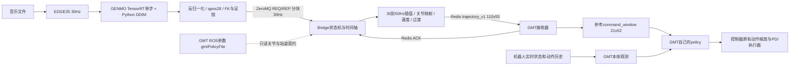

# BUMI music-only：环境、导出、TensorRT、运行与数据流手册

适用分支：完整仓库 `feature/bumi-music-only`；运行分支 `deploy/bumi-music-only-gmt`。
本机完整仓库 `/home/weili/GENMO`，部署目录 `/home/weili/GENMO-deploy-bumi`。
模型为 BUMI v5 scratch s350000。本手册的命令按当前实测环境编写，目标机路径可以调整。

**控制器自己选择 policy。** GENMO 的 ONNX/engine 描述音乐生成模型，不描述 GMT 控制策略。
Bridge 正常启动不传 `--gmt-policy`，只读 GMT 已启动后的 ROS 参数 `/gmtPolicyFile`，
获取它实际配置的关节顺序和默认姿态，不设置 ROS 参数、不改 launch、不选择 GMT 权重。
修改 GMT 策略配置后，重新启动 GMT 和 Bridge，使两者重新建立契约；不支持热切换策略。

相关文档：

- [GMT 接收端逐文件移植说明](BUMI_GMT_GENMO_INTERFACE.md)
- [适配其他 GMT、SONIC 或通用控制器的开发指南](GENMO_CONTROLLER_ADAPTATION.md)
- [运行依赖锁](../requirements/deployment/runtime.lock)
- [代码与验证历史](../记录文本.md)

## 1. 先判断需要做哪些准备

| 情况 | 需要做的事 |
|---|---|
| 在当前电脑运行已交付 s350000 | 已有部署 `.venv`、ONNX、engine；做安装检查，然后按三个终端启动 |
| 复制到同型号 GPU、同 TensorRT 环境的新电脑 | 复制代码和完整模型目录，重新创建 Python 环境；不要复制 `.venv` 或 worktree 的 `.git` 文件 |
| 换 GPU 型号或 TensorRT/libnvinfer 环境 | 准备目标构建环境，在完整仓库构建并验证新 engine，再交付部署目录 |
| 更新 GENMO checkpoint | 在完整仓库重新导出 ONNX、构建 engine、数值对照和打包 |
| 只更新 GMT 自己的权重，输入/机器人契约未变 | 在 GMT 自己的代码/配置中更新；重启 GMT 和 Bridge，无需重新导出 GENMO |
| 换控制器或改变关节数、窗口、坐标语义 | 按适配指南修改 Bridge/接收端，不能只更换 policy 文件名 |

当前机运行环境已经可用。下文安装命令主要用于新电脑，不需要在当前环境重复安装。
部署端仍需要 PyTorch 做 DDIM、张量与运动学计算；去掉训练框架不等于去掉 PyTorch。

## 2. 三套环境的职责

| 环境 | 用途 | 依赖与位置 |
|---|---|---|
| 完整 GENMO 环境 | checkpoint→ONNX、TensorRT构建、PyTorch对照 | `/home/weili/GENMO/.venv`；保留Hydra、Lightning、模型类、配置等导出依赖 |
| 最小 GENMO 运行环境 | EDGE35、常驻推理、DDIM、后处理、Bridge | `/home/weili/GENMO-deploy-bumi/.venv`；不需要Hydra、Lightning、T5、SMPL、GMR、训练数据 |
| 控制器环境 | GMT策略、机器人状态、仿真/实机控制 | `noetic`内的GMT工作区；它自行加载policy、构造本体观测并执行控制 |

本机核验基线：Ubuntu22.04 x86_64，Python3.10.12，RTX4090，驱动580.159.03，
Torch2.6.0+cu124，TensorRT Python10.13.3.9，系统libnvinfer10.13.3.9。
`torch.version.cuda`的12.4与TensorRT系统包的`+cuda13.0`分别属于不同组件，不要求字符串相同；
必须检查实际动态库、驱动和engine元数据，不能只看`nvidia-smi`显示的CUDA上限。

## 3. 新电脑配置运行环境

### 3.1 系统工具和 NVIDIA 库

先确认驱动能看到目标GPU：

```bash
nvidia-smi
python3.10 --version
```

Ubuntu22.04的基础依赖：

```bash
sudo apt-get update
sudo apt-get install python3.10-venv python3-pip git ffmpeg redis-server
```

TensorRT采用本项目已实测的“系统运行库＋虚拟环境Python binding”方式。
先按[NVIDIA Debian安装说明](https://docs.nvidia.com/deeplearning/tensorrt/10.x.x/installing-tensorrt/install-debian.html)
配置对应Ubuntu/CUDA的官方软件源，再查看所需版本是否可安装：

```bash
apt-cache policy libnvinfer10 libnvinfer-plugin10 libnvonnxparsers10
```

复用当前交付engine时，系统包版本为：

```bash
sudo apt-get install \
  libnvinfer10=10.13.3.9-1+cuda13.0 \
  libnvinfer-plugin10=10.13.3.9-1+cuda13.0 \
  libnvonnxparsers10=10.13.3.9-1+cuda13.0
```

其中parser主要用于原仓库构建。若软件源没有这个版本，使用NVIDIA对应版本的本地仓库包，
或选择目标机可用的统一版本并重建engine，不能用任意新版本假定旧engine兼容。
本项目会检查GPU及版本指纹；常规序列化engine的跨平台/GPU/版本限制也见
[NVIDIA支持矩阵](https://docs.nvidia.com/deeplearning/tensorrt/10.x.x/getting-started/support-matrix.html)。

### 3.2 解压代码和模型，创建运行虚拟环境

便携包包含代码、GENMO模型和验收结论，不包含GMT工作区、Docker镜像或Python环境。
在准备放置项目的父目录执行（压缩包路径换成实际位置）：

```bash
tar -xzf /path/to/bumi_music_only_gmt_s350000.tar.gz
cd GENMO-deploy-bumi
python3.10 -m venv .venv
.venv/bin/python -m pip install -r requirements/deployment/runtime.lock
.venv/bin/python -m pip install --no-deps -r requirements/deployment/tensorrt-bindings.lock
```

`--no-deps`用于避免binding另外安装一套TensorRT运行库；前提是系统同版运行库已经准备好。
如果使用uv，第一份锁涉及PyPI和PyTorch cu124两个索引，需要：

```bash
uv pip install --python .venv/bin/python --index-strategy unsafe-best-match \
  -r requirements/deployment/runtime.lock
uv pip install --python .venv/bin/python --no-deps \
  -r requirements/deployment/tensorrt-bindings.lock
```

版本仍由锁固定。pytest是开发测试依赖，不是运行所需依赖。
部署分支直接从项目路径导入模块，不执行`pip install -e .`来重新安装完整训练包。

### 3.3 检查运行环境和模型

```bash
.venv/bin/python -c 'import torch,tensorrt; print(torch.__version__, torch.version.cuda, torch.cuda.is_available(), tensorrt.__version__)'
.venv/bin/python -B scripts/demo/check_bumi_deployment.py \
  --deployment-manifest models/bumi_v5_s350000/deployment.json --inference
```

这一步不要求GMT或ROS在线，不连接生产Redis，不发送机器人动作。检查资产哈希、配套
stats/kinematics、engine环境以及单步输出`[1,120,30]`、`[1,120,2]`的形状和有限性。

### 3.4 准备GMT的独立运行环境

本机已有`noetic`容器，网络为host，实际工作区挂载如下：

```text
宿主机 /home/weili/docker_projects/bumi_GMT_deployment_listao/bumi_GMT_deployment_obs
容器内 /host/Documents/bumi_GMT_deployment_obs
```

检查已有容器，不创建替代工作区：

```bash
docker inspect --format '{{.HostConfig.NetworkMode}}' noetic
docker inspect --format '{{json .Mounts}}' noetic
redis-cli -h 127.0.0.1 -p 6379 ping
```

新电脑需要准备自己的ROS Noetic/GMT容器、对应机器人资产和控制器环境，并将工作区
bind mount到宿主机可读取的位置。Bridge通过`docker inspect`映射GMT参数中的容器路径，
因此GENMO宿主机需能执行Docker命令。换容器名时给Bridge加`--gmt-container 新名称`。
GMT不在容器内时，只要ROS参数指向宿主机可读文件，就不会执行Docker路径映射。

本机GMT的CUDA后端使用容器内隔离ORT1.19.0/CUDA12.4/cuDNN9环境。迁移其他GMT时按其
自己的安装说明配置ROS、ORT和构建，GENMO的TensorRT环境不能替代控制器环境。

## 4. 需要重新导出时：准备完整仓库环境

当前`/home/weili/GENMO/.venv`已经通过导出和对照，直接复用即可。
只运行部署包的人跳过本节至第8节；导出和构建命令均在完整仓库执行。

新建完整仓库副本的参考步骤：

```bash
git clone --branch feature/bumi-music-only git@github.com:XiaoxiaoKuankuan/GENMO.git GENMO
cd GENMO
python3.10 -m venv .venv
.venv/bin/python -m pip install --upgrade pip
.venv/bin/python -m pip install -r requirements/deployment/runtime.lock
.venv/bin/python -m pip install torchvision==0.21.0+cu124 --index-url https://download.pytorch.org/whl/cu124
.venv/bin/python -m pip install -e .
.venv/bin/python -m pip install onnx==1.18.0
.venv/bin/python -m pip install --no-deps -r requirements/deployment/tensorrt-bindings.lock
```

完整依赖来自`setup.cfg`，会包含训练/人体等模块的导入依赖，这是原仓库的职责。
本次没有重建另一份完整导出环境；已实测原环境的关键版本包括Lightning2.3.0、
Hydra1.3.0、hydra-zen0.16.0、ONNX1.18.0、Torch2.6.0+cu124。安装说明不冒充新的全环境验收。
BUMI导出只读取本次checkpoint、stats和kinematics，不需要下载T5权重或SMPL身体模型文件。

检查入口可以导入：

```bash
.venv/bin/python -B tools/export/export_bumi_music_onnx.py --help
.venv/bin/python -B tools/export/build_bumi_music_tensorrt.py --help
.venv/bin/python -B tools/eval/validate_bumi_music_tensorrt.py --help
```

## 5. 导出 BUMI s350000 ONNX

在同一个构建终端设置路径。下列变量不改变系统环境目录：

```bash
cd /home/weili/GENMO
BUMI_CKPT_DIR="$PWD/inputs/checkpoints/bumi_5set_robot_retargeter_pass_v2_qpos30_contact_v5_scratch_s350000_20260914"
BUMI_CKPT="$BUMI_CKPT_DIR/s350000.ckpt"
BUMI_KIN="$BUMI_CKPT_DIR/assets/bumi_kinematics_robot_retargeter_fe934_v1.json"
BUMI_STATS="$BUMI_CKPT_DIR/assets/bumi_qpos30_stats_train_5set_pass_v2_mine_fe934_v2.json"
BUMI_EXP=gem_bumi_music_only_5set_robot_retargeter_pass_v2_qpos30_contact_latest
BUMI_ONNX="$PWD/outputs/onnx/bumi_music/rr_pass_v2_5set_v5_scratch_s350000_20260914/bumi_music_denoiser_s350000_t120_qpos30_contact.onnx"
```

正式导出：

```bash
PYTHONDONTWRITEBYTECODE=1 .venv/bin/python -B tools/export/export_bumi_music_onnx.py \
  --ckpt "$BUMI_CKPT" --exp "$BUMI_EXP" \
  --kinematics "$BUMI_KIN" --stats "$BUMI_STATS" \
  --seq-len 120 --opset 18 --device cuda:0 \
  --output "$BUMI_ONNX"
```

已有正确产物直接复用。需要重新导出时选新输出路径，核验通过后再发布。
必须使用BUMI专用导出器，不能把SMPL的`export_music_only_onnx.py`用于BUMI qpos30模型。
输出是ONNX和同名`.onnx.json`；后者记录源checkpoint、stats、kinematics及图指纹。

ONNX只封装一次带CFG的去噪调用：

| 输入 | 形状 | 内容 |
|---|---|---|
| noisy_motion | `[1,120,30]` | 当前扩散状态，30维是模型运动表示，不是30个关节 |
| diffusion_timestep | `[1]` | 当前扩散时间步 |
| music | `[1,120,35]` | EDGE35条件 |
| length | `[1]` | 有效运动长度 |
| guidance_scale | `[1]` | CFG，默认2.5 |
| 输出motion / contact | `[1,120,30]` / `[1,120,2]` | 单步预测及左右脚接触logits |

DDIM循环、长音乐滑窗、反归一化、qpos解码和足锁在Python中；导出不是把整首音乐生成
过程转换成一个ONNX图。120帧是去噪窗口大小，长音乐通过滑窗连续生成。

## 6. 构建 TensorRT engine

在目标GPU/目标TensorRT构建环境中，继续使用上一节变量：

```bash
BUMI_ENGINE_ROOT="$PWD/outputs/tensorrt/bumi/v5_s350000_20260916"
PYTHONDONTWRITEBYTECODE=1 .venv/bin/python -B tools/export/build_bumi_music_tensorrt.py \
  --checkpoint "$BUMI_CKPT" --onnx "$BUMI_ONNX" \
  --output-dir "$BUMI_ENGINE_ROOT" --device cuda:0 \
  --precision fp16 --fp32-sensitive
```

构建器输出实际engine路径，目录由模型、GPU、TensorRT和精度策略的缓存键决定。
当前4090实测结果为：

```bash
BUMI_ENGINE="$BUMI_ENGINE_ROOT/37ca8e5e0963c6b8694833bea004c838199a57946bbaa6cf071ef4a06227d044/bumi_music_denoiser.engine"
```

其他GPU或环境必须把`BUMI_ENGINE`改成自己构建器输出的路径，不照搬上面缓存键。
`engine.json`必须与engine一起保留。只有ONNX而无配套元数据不能绕过构建器的来源检查。

本次普通FP16没有通过原数值阈值，最终使用`attention_norm_heads_fp32_v1`混合精度：
MLP允许FP16，敏感浮点运算约束FP32，关闭TF32。这里没有修改网络权重、DDIM或放宽阈值。

## 7. 数值对照、打包和复制

用一首本地音乐做单步及完整DDIM对照；替换`BUMI_AUDIO`即可复用：

```bash
BUMI_AUDIO="$PWD/inputs/evals/bumi_v5_scratch_s350000_27_20260914/downloaded/aistpp/audio/mLH0.wav"
BUMI_REPORT_DIR="$PWD/outputs/deployment/bumi_music_v5_s350000"
mkdir -p "$BUMI_REPORT_DIR"
(
BUMI_TMP="$(mktemp -d /tmp/genmo-export-validation.XXXXXX)"
trap 'rm -rf -- "$BUMI_TMP"' EXIT
NUMBA_CACHE_DIR="$BUMI_TMP/numba" MPLCONFIGDIR="$BUMI_TMP/mpl" PYTHONDONTWRITEBYTECODE=1 \
.venv/bin/python -B tools/eval/validate_bumi_music_tensorrt.py \
  --audio "$BUMI_AUDIO" --ckpt "$BUMI_CKPT" --exp "$BUMI_EXP" \
  --onnx "$BUMI_ONNX" --engine "$BUMI_ENGINE" \
  --kinematics "$BUMI_KIN" --stats "$BUMI_STATS" \
  --device cuda:0 --onnx-provider cpu --ddim-steps 20 --cfg-scale 2.5 --seed 42 \
  --output "$BUMI_REPORT_DIR/parity_sensitive.json"
)
```

这里临时目录由`mktemp`精确创建并在验证子shell结束时清理，正式JSON结论留存。
`final_pass=true`后再发布；单步通过不能替代完整DDIM通过。

发布新包时，`--output-dir`必须不存在。下面示例用新的发布目录，避免覆盖现有交付：

```bash
.venv/bin/python -B tools/export/package_bumi_deployment.py \
  --checkpoint "$BUMI_CKPT" --onnx "$BUMI_ONNX" --engine "$BUMI_ENGINE" \
  --kinematics "$BUMI_KIN" --stats "$BUMI_STATS" \
  --output-dir "$BUMI_REPORT_DIR/new_release/bumi_v5_s350000"
```

**不传GMT policy。** v2资产包为六项GENMO文件加`deployment.json`：

```text
bumi_v5_s350000/
  deployment.json
  onnx/    denoiser.onnx及同名.onnx.json（实际文件保留原名称）
  engine/  bumi_music_denoiser.engine、engine.json
  assets/  kinematics.json、stats.json（实际文件保留原名称）
```

把整个目录复制到部署项目`models/bumi_v5_s350000/`，先在候选目录执行检查器再替换当前
已接受版本。路径相对于清单解析；不复制训练checkpoint。运行器仍兼容旧v1七资产包，
但新包不包含GMT权重。ONNX/engine内容未因本次policy解耦而变化。

## 8. 本机三个终端的完整运行指令

### 终端一：启动GMT，沿用GMT自己的模型配置

```bash
docker exec -it noetic bash
cd /host/Documents/bumi_GMT_deployment_obs
```

仿真入口：

```bash
./simulation.sh
```

实机入口（与仿真二选一）：

```bash
./real.sh robot_model:=bumi_4340 gmt_onnx_provider:=cuda gmt_cuda_device_id:=0
```

不传任何policy覆盖参数。当前`load_ac_controller.launch`中的`gmtPolicyFile`决定加载哪个
GMT模型；GENMO没有指定具体文件名。`gmt_onnx_provider`控制GMT策略后端，独立于GENMO TensorRT。
当前仿真2000/40=50Hz、实机500/10=50Hz。启动后仍需沿用GMT自己的模式切换流程启用在线消费。

可在容器中只读检查：

```bash
rosparam get /gmtPolicyFile
rosparam get /gmtMotionMode
rosparam get /gmtRedisKey
```

### 终端二：启动Bridge，不指定policy

```bash
cd /home/weili/GENMO-deploy-bumi
.venv/bin/python -u scripts/demo/demo_bumi_gmt_bridge.py \
  --kinematics models/bumi_v5_s350000/assets/bumi_kinematics_robot_retargeter_fe934_v1.json \
  --verbose
```

默认读取`ROS_MASTER_URI`，未设则为`http://127.0.0.1:11311`。路径不在宿主机时，通过
`noetic`的实际bind mount映射。如果使用其他ROS master或容器名，追加：

```text
--ros-master-uri http://控制器主机:11311 --gmt-container 你的容器名
```

跨主机时ROS参数所指策略必须在GENMO侧有真实共享挂载；当前实现不会自动下载远端模型。
不使用ROS的其他控制器按适配指南提供契约接口，不能仅填写一个不存在的ROS地址。

可选只读检查GMT契约（要求终端一已经启动）：

```bash
.venv/bin/python -B scripts/demo/check_bumi_deployment.py \
  --deployment-manifest models/bumi_v5_s350000/deployment.json --check-gmt
```

### 终端三：启动常驻GENMO

```bash
cd /home/weili/GENMO-deploy-bumi
CUDA_VISIBLE_DEVICES=0 .venv/bin/python -u scripts/demo/demo_music_bumi_console.py \
  --backend tensorrt \
  --deployment-manifest models/bumi_v5_s350000/deployment.json
```

Console输入：

```text
play "/绝对路径/音乐.wav" full --seed 42
play "/绝对路径/另一首.mp3" 10 --start 5 --seed 42
status
stand
quit
```

默认DDIM20、CFG2.5、seed42，120帧窗口/30帧重叠/90帧步进，GENMO30Hz，Bridge50Hz。
`play`换歌会取消旧revision；`stand`回站姿；`quit`退出Console；`shutdown`还请求关闭Bridge。
相同模型常驻，音乐条件变化不重新导出engine。音频由Bridge取得对应ACK后按播放时间启动。

## 9. 数据流：从音乐到电机之前的每个边界



| 层 | 数据及职责 | 代码入口 |
|---|---|---|
| 音频 | 解码所选区间，15360Hz采样/512 hop对应30Hz，提取35维条件 | `gem/utils/music_features.py:extract_edge_baseline35` |
| 生成 | 一个120帧窗口多次调用单步去噪器；CFG在图内，DDIM在Python | `gem/runtime/bumi_music_deploy.py:BumiTensorRTStepRunner/BumiStreamingQposGenerator` |
| 解码 | 30维表示→根xyz3＋根wxyz4＋21关节角=qpos28；contact参与因果足锁 | `gem/robots/bumi/endecoder.py`、`feature_codec.py`、`postprocess.py` |
| 发送 | `begin/chunk/heartbeat/status/stand`；chunk含绝对帧序、revision、CRC和资产身份 | `demo_music_bumi_console.py:BridgeClient`、`gem/runtime/bumi_online_stream.py` |
| 适配 | 帧序和安全检查、坐标对齐、30→50Hz、站姿缓入/返回、独立发布线程 | `demo_bumi_gmt_bridge.py`、`bumi_gmt_plan.py`、`qpos_timeline.py` |
| GMT封包 | 关节按消费者名字重排，重算速度，形成完整滚动窗 | `gem/runtime/gmt_trajectory.py` |
| 消费 | 解析整包、更新参考、构造策略参考特征；真实机器人状态仍从控制器读取 | GMT的`MotionLoaderRedis.h`和`AcController.cpp` |

Console到Bridge默认`tcp://127.0.0.1:7022`，multipart为JSON头及小端float32 qpos负载；
它不是ROS topic，也不是已经转换好的GMT观测。发送的每一帧已完成滑窗融合，不能再次
叠加30帧重叠。前面的非末窗口通常提交90帧，末窗口提交剩余完整序列，帧数以header为准。

30→50Hz按实际时间插值：位置/关节线性插值，四元数使用最短弧SLERP；然后按50Hz重算
线速度、角速度及关节速度，不能复制帧或直接按30Hz差分值冒充50Hz。

Bridge→GMT默认Redis DB0，key=`gmt_online_frame_bumi`，SET整包，TTL250ms；ACK key在其后
加`_ack`。`trajectory_v1`为104字节头＋110×55 float32=24304字节，50Hz，过去10/当前1/未来99。
单帧55维为根xyz3、根wxyz4、机体系根线速度3、机体系根角速度3、关节角21、关节速度21。
GMT实际选当前前后各10帧，构造21×52：高度1＋机体系重力3＋线速度3＋角速度3＋q21＋dq21。

ACK含stream/sequence/revision/plan/时间，表示对应参考已接收，不等于动作已经完成。
重复旧序列不刷新新鲜度；0.2秒没有有效新包，GMT退出在线跟踪。真实未来轨迹已经到达时
跳过旧单帧的centered-delay；详细移植位置见GMT说明。

## 10. 常见问题和验证边界

| 现象 | 检查方向 |
|---|---|
| 读取`/gmtPolicyFile`失败 | 先启动GMT；检查ROS_MASTER_URI与参数名；不会回退到固定旧policy |
| 容器内policy在宿主机不可读 | 检查`docker inspect`、容器名和bind mount；不按同名文件猜模型 |
| 新GMT权重导致形状/关节错误 | 当前适配器要求69/690/1092输入、21关节；改变契约需改适配器 |
| 等待ACK | 检查GMT online模式、控制模式、Redis/key/DB、协议验证日志 |
| engine加载失败 | 先核对GPU、TensorRT、engine.json及SHA，不绕过验证 |
| 首次音乐等待较长 | 特征提取/Numba冷启动与去噪耗时分开看；`status`有分阶段耗时 |
| 接SONIC后输入长度不符 | 先辨认Robot/SMPL/G1/BUMI3模式和观测拼接，不把GMT1092D直接传给SONIC |

已完成的数值基线：s350000完整20步DDIM，TRT对PyTorch qpos最大差0.00343883、FK位置
最大差0.000800386米；contact按原绝对＋相对阈值通过。此次policy来源改变不修改这些权重。

此前实际10秒300帧通信通过；本次新增验证涵盖无policy参数的自动发现、v1/v2清单兼容、
Docker路径解析及同一真实C++接收链路。隔离测试中的ROS参数由只读XML-RPC夹具提供，
不能表述为已经启动真实ROS控制器。具体结果和本次代码提交见记录文本。

正式报告和便携包位于完整仓库 `outputs/deployment/bumi_music_v5_s350000/`。
本次没有启动ROS/Gazebo/实机，没有修改GMT或SONIC工作区。
